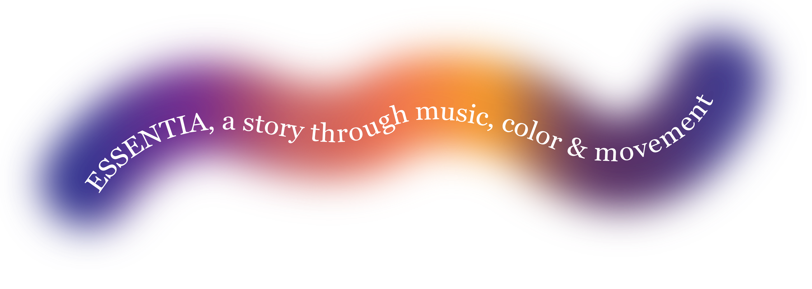
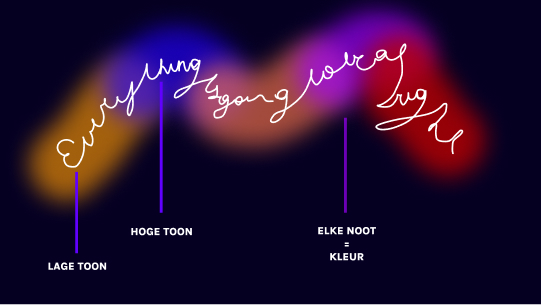
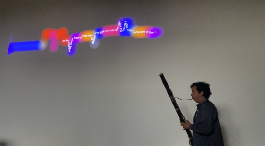
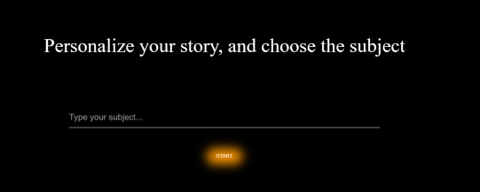
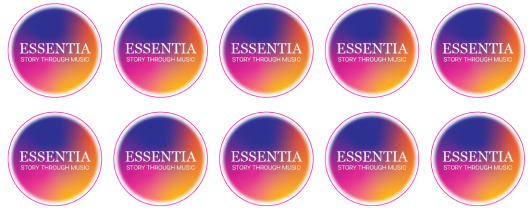
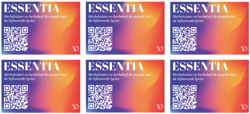
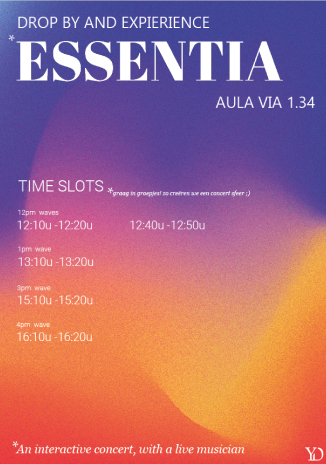
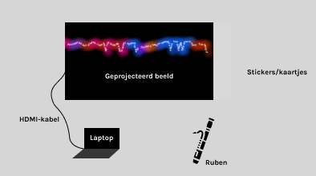
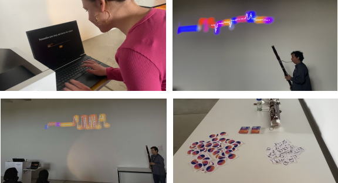

# Essentia



## Concept

> Voor dit project had ik een samenwerking met het conservatorium. Toen Ruben zich voorstelde, vertelde hij over hoe graag hij met zijn muziek verhalen verteld en deze overbrengt aan zijn publiek. Dit inspireerde me meteen om het concept van ‘Essentia’ rond te bouwen.
>
> Bij ‘Essentia’ speelt Ruben live (geïmproviseerde) muziek op zijn fagot, deze muziek kan dus elke emotie hebben. Het algoritme zal de eerste 10 seconde van de live muziek, kunnen afleiden welke emotie de muziek heeft. Op basis van het onderwerp en de bepaalde emotie zal er dus AI gegenereerde tekst geschreven worden.
>
> De visualisatie van dit concept is een gekleurde lijn die tevoorschijn zal komen vanaf de muziek start. Hoe hoger de noot die Ruben speelt hoe hoger de lijn zal gaan, hoe lager de noot hoe lager de lijn. Elke noot heeft ook zijn bijhorende kleur en deze veranderd elke keer als Ruben een andere noot speelt.
>
> Nadat de installatie gedraaid heeft, kan je zowel de muziek als de tekst herbeleven, a.d.h.v. een QR code naar het Soundcloud account van ‘Essentia’. Hierop staan alle nummers met bijhorende tekst. Zo kan elke gebruiker zijn eigen verhaal en onderwerp herlezen en beluiseren.
>
> Kortom het is de bedoeling om aan de hand van tekst, kleur en muziek een verhaal te vertellen en een gevoel weer te geven aan de gebruiker. Zo word de muziek sterker en dieper beleefd en zorgt het voor een betere belevenis.

<br>

**Eerste visualisatie**



**Eind visualisatie**




<br>

## Inhoud

- [Essentia](#essentia)
  - [Concept](#concept)
  - [Inhoud](#inhoud)
  - [Benodigdheden](#benodigdheden)
  - [Tips en Valkuilen](#tips-en-valkuilen)
  - [Extra's](#extras)
  - [Installatie](#installatie)
  - [Code](#code)
    - [HTML](#html)
    - [Imports](#imports)
    - [Event listeners en Tekstgeneratie](#event-listeners-en-tekstgeneratie)
    - [Audiosignaalverwerking en Tonale Analyse](#audiosignaalverwerking-en-tonale-analyse)
  - [Opstelling](#opstelling)

<br><br>

## Benodigdheden

- HDMI-kabel
- Laptop
- Muzikant & instrument (of muziek)
- Beamer
- Opnameapparatuur
- SoundCloud-account
  <br><br>

## Tips en Valkuilen

<br>

**Uitleg en instructies:**

- Zorg ervoor dat je een duidelijke uitleg geeft aan de gebruikers over het concept en de werking van het project.
- Plaats instructies over de installatie om gebruikers te begeleiden in de werking.
- Communiceer duidelijk met gebruikers over de beschikbare tijdsloten.
  <br>

**Samenwerking met de muzikant:**

- Maak goede afspraken met de muzikant over tijd, verwachtingen en inhoud. Leg de werking van de installatie duidelijk uit zodat hij/zij, kan anticiperen en volgen.
  <br>

**Opname Apparatuur:**

- Zorg dat alle benodigde opnameapparatuur beschikbaar en werkend is.
- Test de apparatuur van tevoren om technische problemen tijdens de opnames te voorkomen.
  <br>

**Publiceren op SoundCloud:**

- Vergeet niet om de opnames op SoundCloud te posten.
- Zorg dat je SoundCloud-account klaar is en goed ingesteld staat voor het delen van de opnames.
  <br>

**Logboek bijhouden:**

- Houd alle teksten en bijhorende muziekstukken die tijdens het project worden gemaakt goed bij. (Dit helpt om alles later op Soundcloud te plaatsen.)
  <br>

**API Key aanmaken:**

- Maak een API key aan voor OpenAI en voeg deze toe aan je project.
- Zorg ervoor dat deze gegevens veilig worden opgeslagen en niet openbaar gedeeld worden.
  <br>

**Regelmatig Testen:**

- Test het systeem regelmatig, vooral met live muziek, om ervoor te zorgen dat alles naar behoren werkt. Dit helpt bij het identificeren en oplossen van eventuele problemen voordat ze zich voordoen tijdens een echte sessie.

<br><br>

## Extra's

Ik heb stickers en kaartjes ontworpen die bezoekers kunnen meenemen na hun bezoek aan ‘Essentia’. Zo krijgt elke bezoeker een tastbare herinnering aan hun ervaring, waardoor ze deze nooit zullen vergeten en altijd opnieuw kunnen beleven.

<li> <strong>Stickers</strong> </li> <br>

Ik heb de stickers gemaakt in Adobe Illustator. De ‘Essentia’ stickers hebben een gradient die dezelfde kleuren heeft als de visualisatie van de installatie. In het Illustrator-bestand maakt u twee lagen. Een artworklaag en een CutContour (=snijlijn). De snijcontour heeft een 100% magenta kleur. Hierdoor zal de snijmachine weten op welke lijn hij de stickers uit moet snijden.

Daarnaast gebruik ik voor ‘Essentia’ altijd het font, Georgia Pro. En voor ander gebruikte tekst Roboto.

In de sticker gebruik ik specifiek deze 5 kleuren:

-`#2E3192` -`#F6A72B` -`#E75D31` -`#D62190` -`#683092`

<br>



<br>

<li> <strong>Kaartjes</strong> </li><br>

De kaartjes zijn gemaakt met dezelfde kleuren als die van de stickers (kijk hierboven). De QR code op de kaartjes heb ik gecreëerd met deze link van het ‘Essentia’ Soundcloud account.

-https://soundcloud.com/user-907091839

<br>


<br>

<li> <strong>Affishes</strong> </li><br>

Daarnaast heb ik ook affiches ontworpen om de tijdsloten aan te duiden van wanneer de installatie vanstart zou gaan. Ook deze is gemaakt met dezelfde kleuren en dezelfde typo als de stickers en de kaartjes.


<br><br><br>

## Installatie

Volg deze stappen om het project te installeren en uit te voeren:

1. Download of kloon het project lokaal
2. Installeer node.js in het project
3. npm install (in terminal)
4. Voer het project uit
5. npm run dev (in terminal)
   <br><br><br>

## Code

### HTML

Dit stuk HTML definieert de structuur van de gebruikersinterface. Het bevat een titel, een invoerveld voor het onderwerp, een knop om het proces te starten, en een canvas voor de visualisatie van de muzieknoten.<br>

```
<!doctype html>
<html lang="en">
  <head>
    <meta charset="UTF-8" />
    <meta name="viewport" content="width=device-width, initial-scale=1.0" />

    <title>Creative Coding</title>
  </head>
  <body>
    <button id="recordButton">Start Recording</button>
    <div id="plotDiv"></div>

    <div class="container">
      <canvas id="pitchCanvas" width="1200" height="600"></canvas>
    </div>
    <script type="module" src="src/main.js"></script>

    <script>
      document.getElementById("recordButton");
      document.addEventListener("click", function () {
        // Hier voeg je de CSS-klasse 'hidden' toe aan de form__group en h1 elementen
        document.querySelector(".form__group").classList.add("hidden");
        document.querySelector("h1").classList.add("hidden");
      });
    </script>
  </body>
</html>

```

### Imports

Dit deel van de JavaScript-code initialiseert en importeert de benodigde modules. Het laadt de CSS-stijlen, de Tuner klasse voor het verwerken van audiosignalen, en de OpenAI API voor het genereren van tekst. Ook wordt een timestamp gegenereerd voor het opslaan van de gegenereerde tekst.<br>

```
import "./styles/style.css";
import Tuner from "./tuner.js";
import { OpenAI } from "openai";
import { OPENAI_API_KEY } from "../secret.js";

let timestamp = new Date().getTime();
const openai = new OpenAI({
  apiKey: OPENAI_API_KEY,
  dangerouslyAllowBrowser: true,
});

```

### Event listeners en Tekstgeneratie

Hier worden event listeners toegevoegd aan de knop en het invoerveld om interactie mogelijk te maken. Wanneer op de knop wordt geklikt, wordt de CSS-klasse 'hidden' toegevoegd aan de begin elementen om ze te verbergen, en de rest van de code uit te voeren. De waarde van het ingevoerde onderwerp wordt opgeslagen in de variabele input. De functie getText() wordt aangeroepen om tekst te genereren op basis van het ingevoerde onderwerp en het gevoel.<br>

```
document.getElementById("recordButton").addEventListener("click", function () {
  document.querySelector(".form__group").classList.add("hidden");
  document.querySelector("h1").classList.add("hidden");
  document.querySelector("#recordButton").classList.add("hidden");
  input = document.getElementById("name").value;
});

document.getElementById("name").addEventListener("focus", function () {
  document.querySelector(".form__group").classList.remove("hidden");
  document.querySelector("h1").classList.remove("hidden");
});

let feeling = "anxious";
let input = "";
let lyrics = "";

async function getText() {
  if (input && feeling) {
    const completion = await openai.chat.completions.create({
      messages: [
        { role: "system", content: "You are a lyrics writer that puts a lot of feeling in her songs." },
        {
          role: "user",
          content: `Please generate a ${feeling} lyrics about ${input}, text should be around 250 words. The lyrics should not include any structural information like 'verse' or 'bridge'. Additionally, please continue building on the existing lyrical text, if any.\n\nExisting lyrics:\n${lyrics}`,
        },
      ],
      model: "gpt-3.5-turbo",
    });

    lyrics += completion.choices[0].message.content;
    localStorage.setItem("lyrics-" + timestamp, lyrics);
  }
}

```

### Audiosignaalverwerking en Tonale Analyse

Deze sectie houd zich bezig met de verwerking van een audiosignaal en de analyse van de toonhoogte. Hier is een uitgebreide uitleg van de belangrijkste onderdelen van de code:

1. **Configuratie van Kleurcodering voor Noten**

   - **noteColors**: Een object dat specifieke kleuren toewijst aan muziekschalen, waardoor de noten visueel te onderscheiden zijn op basis van hun toon.<br><br>

   ```
   const noteColors = {
   C: "#FF9900",
   "C#": "#BB0000",
   D: "#9E00FF",
   "D#": "#FF450C",
   E: "#FF9900",
   F: "#B52C00",
   "F#": "#FF9900",
   G: "#1363FF",
   "G#": "#9E00FF",
   A: "#E0027A",
   "A#": "#9E00FF",
   B: "#FF0000",
   };

   ```

2. **Definiëren van Toonaarden**

   - **toonaarden**: Een array van objecten die verschillende toonladders beschrijven. Elk object bevat de toonsoort, grondtoon, en de noten die deel uitmaken van de toonladder.<br><br>

   ```
   const toonaarden = [
   { toonsoort: "mineur", grondtoon: "A", toonladder: ["A", "B", "C", "D", "E", "F", "G"] },
   // Alle toonladders
   // ...
   ];

   ```

3. **Initialiseren van de Tuner**

   - **tuner**: Een instantie van de Tuner klasse, geïnitialiseerd op een standaard A4-frequentie van 440 Hz.
   - **lastNote**, **maxNotesVisual**, **maxNotes**, **notes**, **differentNotes**, **frameRate**, **lastDraw**: Variabelen voor het bijhouden van gedetecteerde noten en hun weergave in de visualisatie.<br><br>

   ```
    const tuner = new Tuner(440);
    let lastNote = null;
    const maxNotesVisual = 75;
    const maxNotes = 25;
    const notes = [];
    const differentNotes = [];
    const frameRate = 13;
    let lastDraw = new Date().getTime();

   ```

4. **Detecteren van Noten**

   - **tuner.onNoteDetected**: Een callbackfunctie die wordt aangeroepen wanneer een nieuwe noot wordt gedetecteerd. De noot wordt toegevoegd aan de notes array voor visualisatie en aan differentNotes voor verdere analyse.
   - **lastDraw**: Houdt bij wanneer de laatste tekening is gemaakt om de visualisatiesnelheid te controleren op basis van de frame rate.<br><br>

   ```
   tuner.onNoteDetected = function (note) {
   const now = new Date().getTime();
   if (now - lastDraw > 1000 / frameRate) {
       notes.push(note);
       if (notes.length > maxNotesVisual) {
       notes.shift();
       }
       lastDraw = now;
       draw();
   }

   if (!lastNote || lastNote.value !== note.value) {
       note.timestamp = new Date().getTime();
       note.duration = 0;
       if (lastNote && lastNote.timestamp) {
       note.duration = note.timestamp - lastNote.timestamp;
       }
       differentNotes.push(note);
       if (differentNotes.length > maxNotes) {
       differentNotes.shift();
       }
       lastNote = note;
   }
   };

   ```

5. **Visualiseren van Noten**

   - **draw**: De functie om noten te tekenen op het canvas. De noten worden op een regelmatige afstand (xPosDistance) geplaatst en de hoogte (yPosStart) wordt aangepast op basis van de toonhoogte (note.value).
   - **waveHeight**: Functie om de hoogte van de golf (toonhoogte) te berekenen met enige niet-lineaire schaling.
   - **drawTextAlongPath**: Tekent tekst langs een pad dat wordt bepaald door de gedetecteerde noten.<br><br>

   ```
   const xPosDistance = 15;
   const yPosStart = canvas.height;
   let pathPoints = [];

   function draw() {
   context.clearRect(0, 0, canvas.width, canvas.height);
   let x = 0;
   for (let i = 1; i < notes.length; i++) {
   context.lineCap = "round";
   context.strokeStyle = noteColors[notes[i].name];
   context.globalAlpha = 0.01;

       for (let j = 1; j <= 10; j++) {
       context.lineWidth = j * 9;
       context.globalAlpha = 0.05;
       context.beginPath();
       context.moveTo(x - xPosDistance, yPosStart + (notes[i - 1]?.value || notes[i]?.value) * -5);
       context.lineTo(x, yPosStart + waveHeight(notes[i].value) * -5);
       context.stroke();
       }
       if (lyrics && i == notes.length - 1) {
       pathPoints.push({ x: x, y: yPosStart + waveHeight(notes[i].value) * -5 });
       }
       x += xPosDistance;

   }

   if (pathPoints.length > 0) {
   let lastPoint = pathPoints[pathPoints.length - 1].x;
   for (let i = pathPoints.length - 1; i >= 0; i--) {
   pathPoints[i].x = lastPoint - (pathPoints.length - i) \* xPosDistance;
   }
   }

   context.font = "20px Arial";
   context.fillStyle = "white";
   context.globalAlpha = 1;
   drawTextAlongPath(lyrics, pathPoints);
   }

   ```

   <br><br>

## Opstelling

De opstelling van ‘Essentia’ is heel eenvoudig, de laptop (waar de installatie op runt) zal verbonden worden met de beamer aan de hand van een HDMI kabel. Op deze laptop zullen de gebruikers ook het onderwerp kunnen ingeven.

De muzikant staat naast of onder het geprojecteerde beeld, zodat de muziek goed door de microfoon wordt opgenomen. Dit zorgt er ook voor dat, wanneer er foto’s en video’s van de installatie worden gemaakt, de muzikant duidelijk zichtbaar is en het concept goed overkomt.

Aan de uitgang waar de gebruikers weer naar buiten gaan, liggen de kaartjes en de stickers zodat ze deze na de demonstratie makkelijk kunnen meenemen.

**Schetsen opstelling**
<br>



**Effectieve opstelling**
<br>


